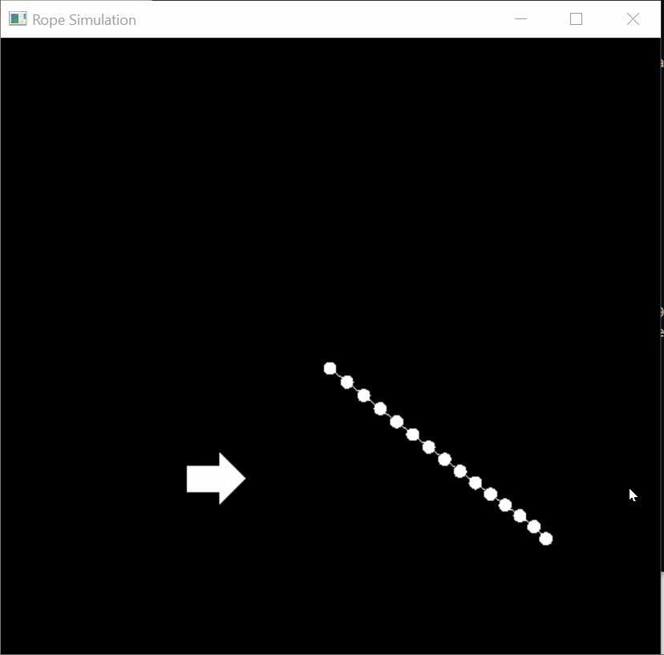

# Position Based Dyanamics Simulation
This project contains for different simulations implement position based dynamics. Point constraints, distance constraints, and collision constraints are all implemented.

## How to use
To use this project, you must get OpenGL for python

